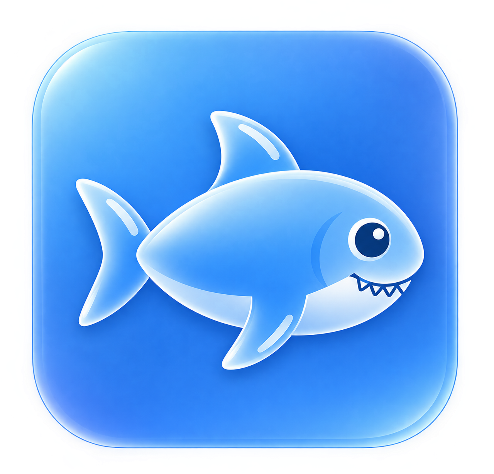

# Harbor

### Se sente distante?

Um espaço feito para aproximar quem importa, mesmo quando vocês estão longe.

 

[Baixar Harbor](https://github.com/Joshua-lvt/Harbor-Releases/releases/latest)
&nbsp;&nbsp;•&nbsp;&nbsp;
[Harbor Releases](https://github.com/Joshua-lvt/Harbor-Releases)

## O que é o Harbor?

O Harbor nasceu de uma ideia simples:

**estar perto de alguém não deveria depender da distância.**

Mais do que apenas conversar, o Harbor foi criado para transmitir a sensação
de que a outra pessoa está por perto.

---

## Feito para duas pessoas

O Harbor foi pensado especialmente para conexões entre parceiros.

Sem transformar sua relação em uma lista de servidores, canais ou grupos.

Só vocês.

---

## O que você pode fazer

### Conversar

Tenha um espaço privado para trocar mensagens, imagens, arquivos e outros momentos do dia a dia.

### Fazer chamadas

Converse por voz e vídeo e continue perto mesmo quando vocês estiverem
fisicamente distantes.

### Compartilhar a tela

Mostre o que está acontecendo no seu computador ou celular em tempo real.

Assista algo junto, ajude em alguma tarefa, mostre um jogo ou simplesmente
compartilhe aquele momento.

### Presença

Veja quando a outra pessoa está online, ausente ou indisponível e tenha uma
noção melhor de quando ela está por perto.

### Atividade

Acompanhe a atividade compartilhada e veja o que está acontecendo no momento,
além do histórico disponível.

### Localização

Quando compartilhada, a localização permite visualizar onde vocês estão e a
distância entre vocês.

### Notificações

Receba avisos de mensagens, chamadas e acontecimentos importantes mesmo
quando o Harbor estiver em segundo plano.

### Modo para dormir

Entre em um modo de descanso e, quando os dois concordarem, compartilhem esse
momento de forma mais tranquila.

### Assistir juntos

Compartilhe uma sessão de vídeo via YouTube e sincronize momentos para assistir algo
junto mesmo estando em lugares diferentes.

---

## Uma conexão que continua

O Harbor foi pensado para estar presente durante o dia inteiro.

No computador.

No celular.

Durante uma conversa.

Durante uma chamada.

Assistindo alguma coisa.

Ou simplesmente mostrando que você ainda está por perto.

A ideia é que o Harbor deixe de parecer apenas um aplicativo e se torne uma
parte natural da rotina de vocês.

---

## Harbor Mobile e Companion

O Harbor não termina no computador.

Com o Harbor Mobile, seu celular pode participar da experiência de forma
independente, permitindo continuar conectado mesmo quando o parceiro não tem um computador.

O modo Companion transforma o celular em uma extensão da sua presença no
Harbor, sem precisar transformar o computador em um intermediário.

---

## Do seu jeito

O Harbor possui diferentes opções de aparência para que a experiência possa
ser adaptada ao seu gosto, mantendo a identidade visual do projeto.

A personalização faz parte da ideia de transformar o Harbor em um espaço que
realmente pareça seu.

Você pode customizar os sons padrão de notificação do seu parceiro. Coloque um som especial
para ele ouvir sempre que você mandar mensagem ou fizer uma ligação :)

---

## Privado por natureza

O Harbor foi criado pensando em uma experiência mais pessoal e privada.

A comunicação entre os dispositivos foi pensada para acontecer diretamente
sempre que possível, não há servidor transportando arquivos ou mensagens, tudo é criptografado de ponta a ponta
garantindo ao máximo a sua segurança.

---

## Plataformas

O Harbor está sendo desenvolvido para diferentes dispositivos.

### Desktop

- Windows
- Linux

### Mobile

- Android

Mais plataformas poderão chegar no futuro.

---

## Baixar

Para baixar diretamente a versão mais recente:

**[Baixar a versão mais recente](https://github.com/Joshua-lvt/Harbor-Releases/releases/latest)**

---

## Atualizações

O Harbor possui um sistema de atualização próprio.

As versões oficiais são publicadas no repositório de Releases, que também
serve como fonte para o sistema de atualização do aplicativo.

**[Ver todas as versões](https://github.com/Joshua-lvt/Harbor-Releases/releases)**

---

## Um projeto em evolução

O Harbor ainda está crescendo.

Novas ideias, melhorias e recursos continuam sendo adicionados conforme a
experiência evolui.

O objetivo não é criar apenas mais um aplicativo de comunicação.

É criar um lugar onde duas pessoas possam continuar próximas.

---

### Harbor

**Mesmo longe, ainda perto.**

 

